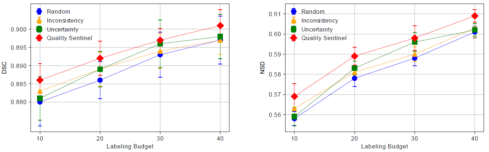
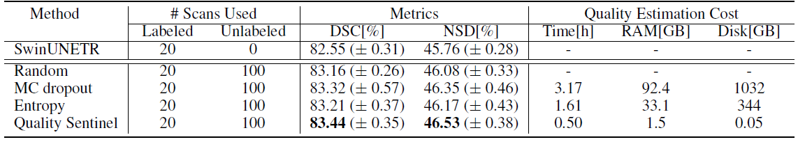

# Quality-Sentinel
This is the repository of Quality Sentinel, a label quality evaluation model for medical image segmentation, implemented with PyTorch.

### 1. Brief Introduction of this method
The model accepts an image-label pair of CT multi-organ segmentation as input and estimates DSC relative to ground truths.

The text-driven condition module embeds the organ names, serving as the conditional input of the model to recognize 142 different organs and improving the model performance. The training of the model involves a compositional loss, combining optimal pair ranking and MSE, to align predicted with actual DSC.

### 2. Framework for Quality Sentinel

(1) Training Framework

(2) Dataset Construction

Both the training and testing data are drawn from the DAP Atlas dataset featuring 142 organs. We fine-tuned the pretrained [STUNet](https://github.com/uni-medical/STU-Net) on the [DAP Atlas](https://github.com/alexanderjaus/AtlasDataset). Model checkpoints were saved at specified epochs: 10; 20; 30; 40; 50; 100; 200; 300; 400; 500. From each checkpoint, pseudo labels were generated, creating a dataset of CT scans paired with pseudo labels of varying quality and their corresponding ground truth DSC.

### 3. Results for Quality Sentinel

(1) The scatter plot of ground truth and predicted DSC on testing data, the high linear correlation coefficient demonstrates the performance of the model. 

(2) Human-in-the-Loop (active learning) results of label quality ranking methods on the TotalSegmentator. Quality Sentinel helps to reduce annotation costs, or improve the data efficiency.

(3) Semi-supervised learning results of label quality ranking methods on the TotalSegmentator. Quality Sentinel outperforms all alternatives. It also significantly reduces quality estimation costs (6 times less time, 60 times less RAM, and 20,000 times less disk space compared to MC dropout) by employing a 2D model that evaluates only the output mask slices instead of extensive 3D computation.

